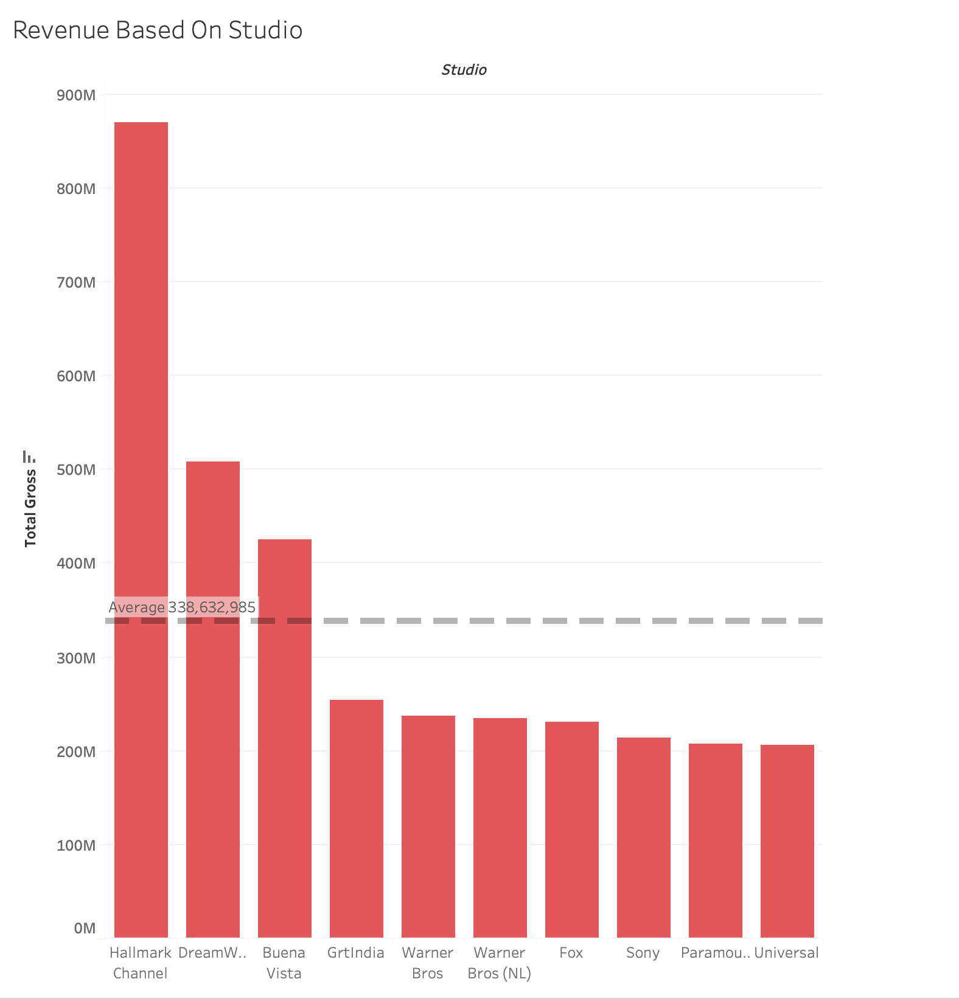
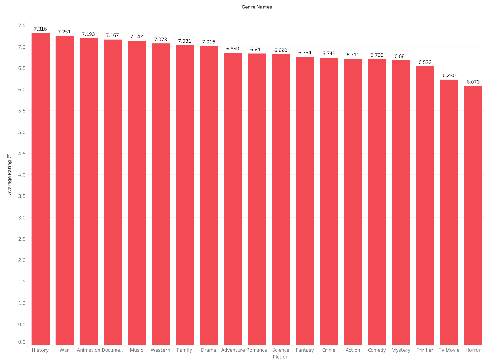

# Movie Analysis: What Makes a Successful Film?

Authors: Ramses Nestor and Ben Gilbert
## Overview
This project analyzes different characteristics of films to determine what makes films more successful than others. Descriptive analysis of movie data from multiple sources shows that movies from certain studios, certain genres, and certain runtimes perfrom better than others based on profit, revenue and popularity. Movie producers can use this analysis to create movies that will perform successfully.
## Business Problem

A new movie producer wants as much information on the industry before they start making films. The soon to be producer we are providing this analysis for wants to know ways that they can assure movies they make will be successful. We have been tasked with providing actionable insights that will help forge how they make movies.
## Data Sources
The data used for this analysis comes from four different sources and were used for these main DataFrames:
1. [IMDB](https://www.imdb.com/) - `less_90`,`more_90`,`all_runtime`
2. [TheMovieDB](https://www.themoviedb.org/) - `df_gross`
3. [Box Office Mojo](https://www.boxofficemojo.com/) - `df_gross`
4. [The Numbers](https://www.the-numbers.com/) - `budgets`

The most important information used from these sources were movie titles, runtime, revenue, profit, studios, genre, and popularity.
## Methods
This project uses descriptive analysis, including a two sample T-test, linear regression, and visuals derived from data. This provides useful information for why some movies are more successful than others.
## Results
These are top movie studios that produce higher revenues than the rest of their counterparts:

These are the top movie genres based on the avergae rating they receive:

We ran a two sample T-test comparing movies shorter than 90 minutes and movies longer than 90 minutes. The result of our test shows that movies longer than 90 minutes return higher profits on average. Then with a linear regression model we found length of a movie explains about 19% of the popularity rating it receives. These two tests display that, to an extent, runtime dictates how popular a movie will be and the profit it will return.
## Conclusion
Based on our data analysis we have three final recommendations.
1. Work with one of our top studios because they have the highest gross revenues.
2. Make movies under one of our top genres because these types of movies earn the highest ratings.
3. Make movies that are longer than 90 minutes and aim around 120 minutes in length. These movies return the highest profits.
### Next Steps
- Explore which age rating (P, PG, PG-13, R) would be best
- Explore which actors bring in the most revenue
- Explore which directors are best for each genre
## For More Information
See full analysis in the [Jupyter Notebook](https://github.com/ramses02/Movies_Phase_2/blob/main/notebook.ipynb) and review this presentation (will link pdf of the presentation once it's in our repo)
## Repository Structure